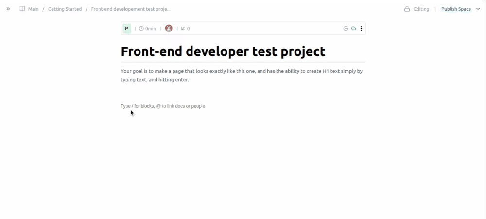

## Getting Started

This is a [Next.js](https://nextjs.org/) project bootstrapped with [`create-next-app`](https://github.com/vercel/next.js/tree/canary/packages/create-next-app).

The app lets users to write in a text editor with wysiwyg approach. 

There is a text input area where users can type their text. Initially it has empty content and has a default styling. When the user starts writing on it the app starts to save each input change on a local state and conditionally saves the input value.

- Making a heading tag

  Users can make a heading tag by typying `/1` at the beginning. Then a modal pops up to let the user pick options like `Heading 1` and `Extended Heading 1`. The style will automatically change to predefined `heading1` style and the input area placholder reads `Heading 1`. Then when the user starts wriiting the style is in `Heading 1`. It is also possible to continue wriiting after the `/1` tag which ignores the popup modal and changes the styling to `Heading 1`. The `Heading 1` tag also has appropriate `marginBottom` value to give a sufficient space after a `Heading` before a paragraph starts. 

- When the user wants to end the current block just pressing `Enter` key will end the block and saves it to a local state. Each block is saved in a local array of block objects.

- The default text has a predefined `p` style which represents a noremal paragraph text style. 

### Prerequisites

- Node.JS
- Next.JS

### SetUp 
- Clone the repository 
`git clone https://github.com/henatan99/helpjuice-wysiwyg-nextjs.git`

- cd to the project directory 
`cd helpjuice-wysiwyg`

- Install dependancies 
`npm install` or `yarn`

- And follow the App Usage instructions in the next section

### Launch App in development server
- `npm run dev`

Runs the app in the development mode.\
Open [http://localhost:3000](http://localhost:3000) to view it in the browser.

The page will reload if you make edits.\
You will also see any lint errors in the console.

### Usage
Either run the app in local server after setting it up or just go to the live demo and give it a try. 

## Authors

👤 **Henok Mossissa**

- GitHub: [@henatan99](https://github.com/henatan99)
- Twitter: [@henatan99](https://twitter.com/henatan99)
- LinkedIn: [Henok Mossissa](https://www.linkedin.com/in/henok-mekonnen-2a251613/)

## :handshake: Contributing

Contributions, issues, and feature requests are welcome!

## Show your support

Give a :star:️ if you like this project!

## Acknowledgment 

- [HekpJuice](https://helpjuice.com/) for the intersting challenge and cool Figma design references

## :memo: License

This project is [MIT](./LICENSE) licensed.

## Deploy on Vercel

The easiest way to deploy your Next.js app is to use the [Vercel Platform](https://vercel.com/new?utm_medium=default-template&filter=next.js&utm_source=create-next-app&utm_campaign=create-next-app-readme) from the creators of Next.js.

Check out our [Next.js deployment documentation](https://nextjs.org/docs/deployment) for more details.
